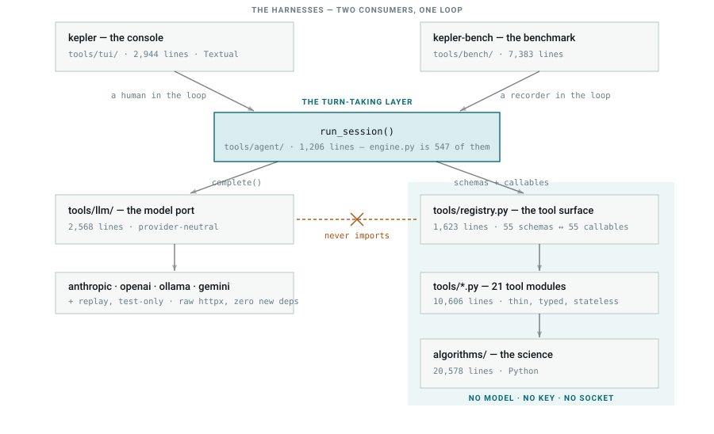
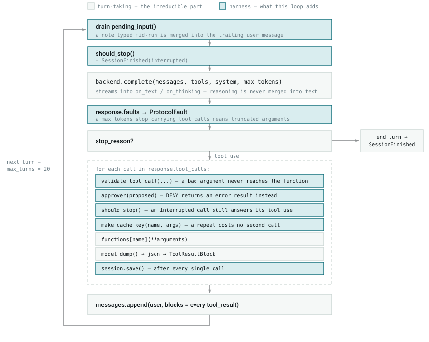
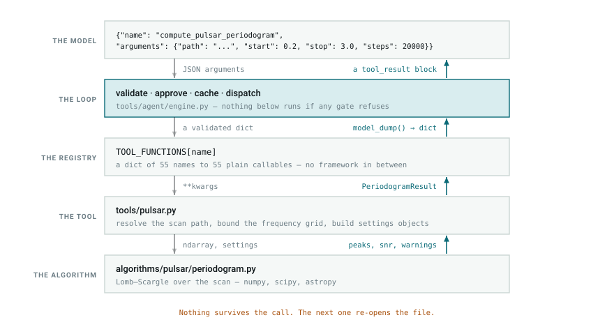
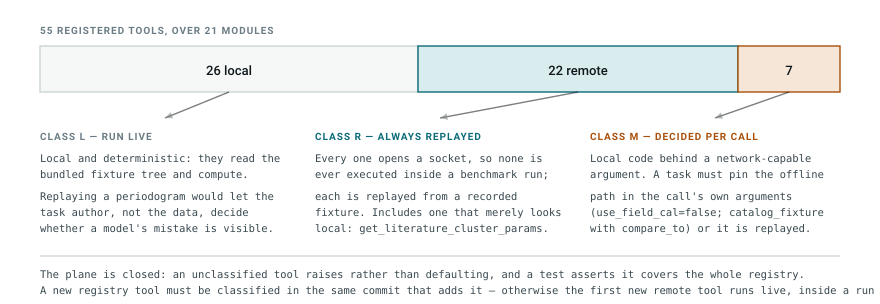
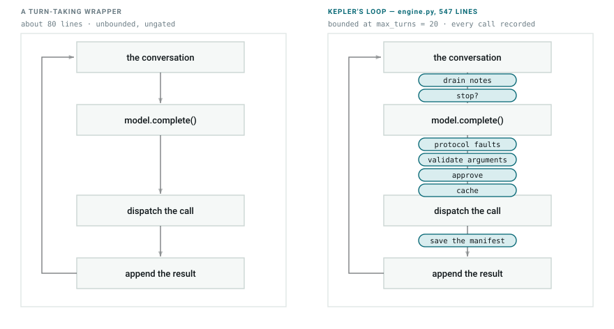
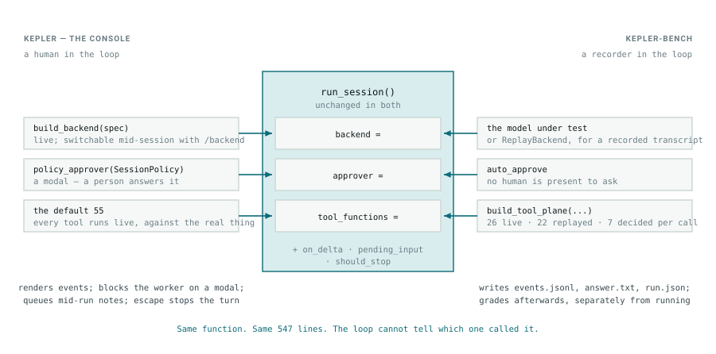

# Kepler's Layers: Tools, Turn-Taking, and the Harness

Date: 2026-09-25
Status: current-state reference

Three separable things in this repository get called by the same words. This
document draws the difference, because the distinction decides where a change
belongs: a new astronomy capability, a change to how a turn is taken, and a
change to how a run is governed are three different PRs touching three
different layers.

[tool-architecture.md](tool-architecture.md) is the master architecture; this
is the layer map over it. Line counts are `wc -l` over tracked sources in the
2026-09-25 working tree, tests excluded.

| Layer | Path | Lines | Model-aware? |
| --- | --- | ---: | --- |
| Harnesses | `tools/tui/` + `tools/bench/` | 10,327 | yes |
| Turn-taking | `tools/agent/` | 1,206 | yes |
| Model port | `tools/llm/` | 2,568 | yes |
| Tool surface | `tools/registry.py` + `tools/*.py` | 12,229 | schema-shaped; calls none |
| Algorithms | `algorithms/` | 20,578 | no |
| **Non-test total** | | **46,908** | 30.1% of it |

Plus 27,821 lines of tests, which are algorithm-preservation tests — they pin
bit-exact parity against recorded Skynet output rather than assert correctness
(`tests/README.md`).

---

## 1. The five strata

<picture>
  <source media="(prefers-color-scheme: dark)" srcset="assets/architecture/fig-1-strata-dark.svg">
  
</picture>

The tinted block is the part that does not know a model exists. Every tool and
every algorithm is an ordinary Python function a script or notebook can import
and call; the loop is optional and sits above them. Serving is optional too —
the console opens no port.

The one-way rule is enforced rather than aspirational: nothing under
`algorithms/` imports `tools/agent/` or `tools/llm/`, and the adapters never
import `tools/registry.py`, because translating 55 schemas into a provider's
dialect is the engine's job and it does it once before the turn loop starts
(`docs/tool-architecture.md` §10).

> **One known exception to the wider folder split.**
> `algorithms/hrdiagram_py/local_grid.py` and `isochrones.py` both do
> `from tools import config`, to read `ISOCHRONE_DIR`. It is a data-root
> setting, not a model dependency, so the model boundary above is intact —
> but `algorithms/` → `tools/` is not quite as clean as the folder split
> implies.

---

## 2. The turn-taking layer

`run_session()` in `tools/agent/engine.py` — 547 lines, about 1% of the
repository. It takes a user message and a backend, yields an iterator of
events, and takes a `Decision` back in through an approver callable. Keeping
the two directions separate is what lets a console, a benchmark and a plain
`for` loop consume it unchanged.

<picture>
  <source media="(prefers-color-scheme: dark)" srcset="assets/architecture/fig-2-one-turn-dark.svg">
  
</picture>

**Eight of the fourteen steps drawn here are not turn-taking.** Strip the
shaded boxes and there is still a working agent loop — one that cannot be
interrupted, cannot be corrected mid-run, dispatches malformed arguments
straight into real functions, asks nobody before a 121,515-product archive
download, re-issues the same failing call every turn, and leaves no record
when it dies. The shaded boxes are the difference between a loop and a
harness; §4 tabulates them.

---

## 3. The tools

55 ordinary Python functions, registered in `tools/registry.py` as an
Anthropic-dialect schema plus the callable it maps to. They stay thin: accept
normal values, normalise and validate locally, call an algorithm package
rather than reimplementing astronomy, and return a small Pydantic model plus
warnings, errors and artifact paths.

> **One public tool call is Kepler's execution boundary.** No run, stage,
> session or batch object spans two calls; no tool writes state another tool
> reads.

<picture>
  <source media="(prefers-color-scheme: dark)" srcset="assets/architecture/fig-3-tool-call-dark.svg">
  
</picture>

The descent converts a model's JSON into Python values; the ascent converts a
typed result back into bounded JSON and a path on disk. The tool layer exists
to own those two conversions, so the algorithm never has to know it is being
called by a model and the model is never handed a NumPy array. That is the
working rule stated in `tool-architecture.md`: *Astropy-native inside,
JSON-and-artifact-native outside.*

It is also why the pulsar pipeline's stage order lives in a system prompt
rather than a state machine, and why folding at a wrong period returns a flat
profile instead of an error (`docs/pulsar-tool-pipeline.md`).

### The tools are not one surface — they are three

<picture>
  <source media="(prefers-color-scheme: dark)" srcset="assets/architecture/fig-4-tool-plane-dark.svg">
  
</picture>

The classification is per tool, never per module: `tools.hr_diagram` alone
spans all three classes, and `get_literature_cluster_params` returns published
cluster parameters yet fetches them through VizieR. This table
(`tools/bench/plane.py::TOOL_CLASSES`) is the mechanism that lets a benchmark
replay the remote half of the surface while still running the computational
half for real.

---

## 4. What the harness is

The definition the code supports is not "the thing that takes turns":

> A harness is what makes a model's run **governable, observable, reproducible
> and gradeable**. Turn-taking is the least of it.

<picture>
  <source media="(prefers-color-scheme: dark)" srcset="assets/architecture/fig-5-gates-dark.svg">
  
</picture>

Same four steps; seven gates on the wires between them. Each exists because of
a specific failure that was observed or is specifically anticipated:

| Gate | Where it sits | The failure it prevents |
| --- | --- | --- |
| `pending_input` | top of every turn | A correction arriving only after the run is over. Merged into the trailing user message, not sent as its own turn — two consecutive user messages are not a shape every provider accepts. |
| `should_stop` | every turn, and before each call | A run you cannot get out of. A pending call is refused with an `interrupted` result rather than abandoned: every `tool_use` needs a `tool_result` or the conversation can never be sent again. |
| `ProtocolFault` | after `complete()` | A tool call truncated at the token ceiling being read as an intentional one. |
| `validate_tool_call` | before dispatch | A malformed argument reaching a real function and raising mid-turn. The tool is never called; an error result goes back to the model and the loop continues (S8). |
| `approver` | before dispatch | 121,515 MAST products downloaded because a model set `download=true`. Risk is tagged on the *argument* (`DOWNLOAD_FLAGS`), so an ordinary archive search stays unprompted. |
| `make_cache_key` | before dispatch | A model re-issuing an identical failing call across turns — observed in a real transcript, burning half a six-turn budget on one bad NED query. |
| `session.save()` | after every call | A killed run leaving nothing readable behind. The manifest is written at session start, after every tool call, and at every terminal state. |
| `max_turns = 20` | the loop itself | An unbounded spend. |

---

## 5. Two harnesses, one loop

`run_session()` has exactly three injection seams and three optional hooks.
The console and the benchmark are both callers that fill them in differently;
the loop is byte-identical in both and cannot tell which one invoked it.

<picture>
  <source media="(prefers-color-scheme: dark)" srcset="assets/architecture/fig-6-seams-dark.svg">
  
</picture>

The console puts a person in the seams; the benchmark puts a recorder in them.
That is the entire difference. Neither is the loop; both are harnesses *around*
it, and the loop was designed with exactly enough seams that neither had to
modify it. See `tool-architecture.md` §10.2 for the console and
`benchmarking/harness.md` for the benchmark.

---

## 6. The difference, stated plainly

| | Answers | Fails when | Here |
| --- | --- | --- | --- |
| **Tools** | "What can be done?" | The astronomy is wrong. | `tools/*.py` + `algorithms/` — 39,120 lines |
| **Turn-taking** | "Whose move is it?" | A `tool_use` goes unanswered and the conversation cannot be resent. | `engine.py`'s six unshaded steps |
| **Harness** | "Can this run be trusted, stopped, explained, repeated and scored?" | A run costs money nobody approved, or produces a number nobody can reproduce. | The eight gates, plus `tools/tui/` and `tools/bench/` — 10,327 lines |

The tools decide what is *possible*, turn-taking decides what happens *next*,
and the harness decides what is *permitted, recorded and believed*.

**So: is Kepler a harness?** No — it contains two. Kepler is an astronomy
capability library that ships a console and a benchmark over it. The
turn-taking genuinely is a thin wrapper, deliberately so, and it is also not
where the engineering is: delete `tools/agent/`, `tools/llm/`, `tools/tui/`
and `tools/bench/` and 39,120 lines still import, still run, and still solve
plates and fold pulsars. The evidence that a harness is not the loop is §5 —
two harnesses share the loop verbatim and differ only in three arguments. If
turn-taking were the harness, that substitution would be impossible.

This is the reading the code supports where the prose disagrees with itself:
`README.md` calls Kepler "an agentic, tool-enabled system", while
`tool-architecture.md` §9 lists "No orchestration framework" as a non-goal.
Both are true of different layers.

---

## 7. Where to check each claim

| Claim | File |
| --- | --- |
| The loop, all of it | `tools/agent/engine.py` — `run_session` at line 66, the per-call turn at line 342 |
| The twelve events consumers read | `tools/agent/events.py` |
| Approval, and risk carried by an argument | `tools/agent/policy.py` — `TOOL_RISK`, `DOWNLOAD_FLAGS` |
| Pre-dispatch validation | `tools/llm/validation.py`, called from `engine.py:379` |
| The 55 schemas and the 55 callables | `tools/registry.py` — `TOOL_SCHEMAS`, `TOOL_FUNCTIONS` |
| The three tool classes and their predicates | `tools/bench/plane.py` — `TOOL_CLASSES`, `OFFLINE_PREDICATES` |
| The console filling the seams | `tools/tui/app.py:415` |
| The benchmark filling the seams | `tools/bench/harness.py:475` |

## Regenerating the figures

The twelve SVGs under `assets/architecture/` are generated — one geometry, two
palettes, a `-light`/`-dark` pair per figure behind a `<picture>` element, the
same pattern the README banner uses. Edit `assets/architecture/make.py` and
re-run it:

```bash
python3 docs/assets/architecture/make.py
```

Line counts quoted inside the figures are `wc -l` values; re-measure before
changing them.
