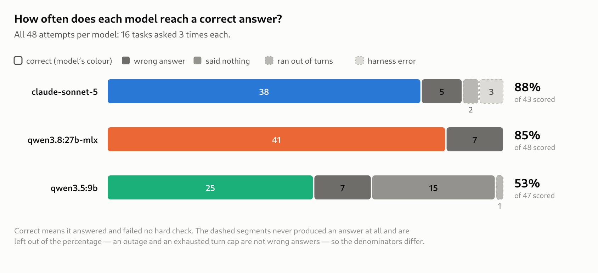
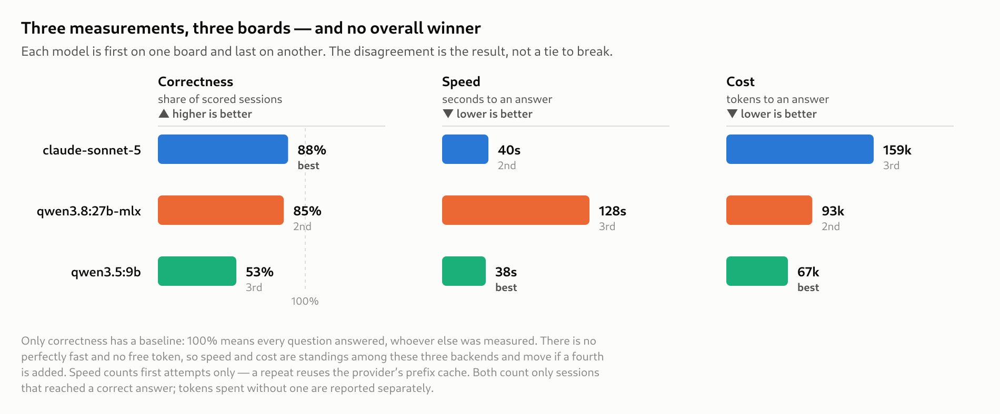
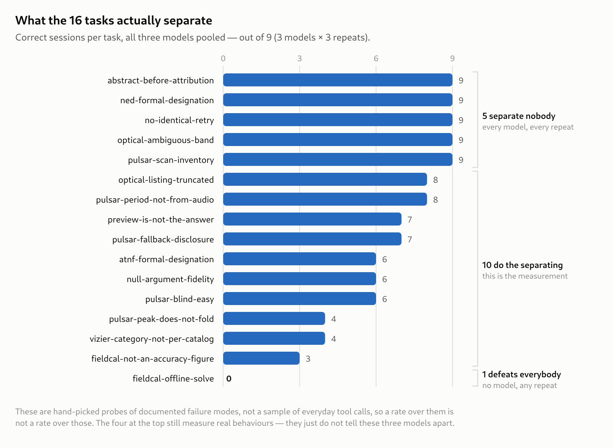
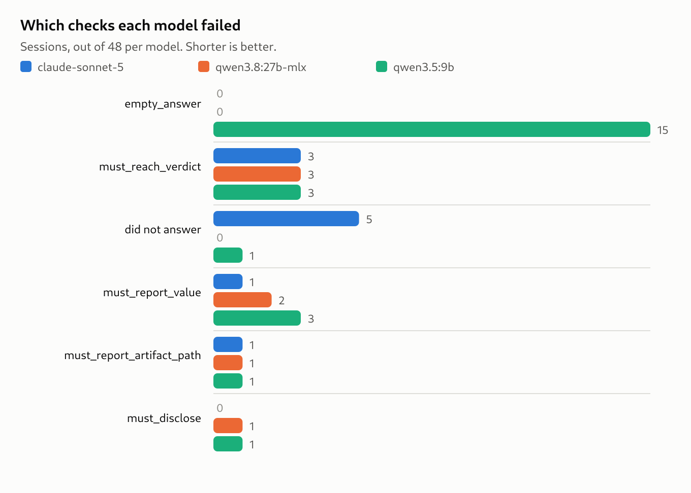

# Benchmark Results — Kepler's Tool Surface

**What this measures.** For each prompt, three things: did the model reach a
correct answer, were its tool calls and reasoning acceptable, and what did the
answer cost in time and tokens. Nothing else enters a score.

**Every verdict is a deterministic assertion against recorded evidence.**
Nothing here asks a model whether an answer is correct. An optional LLM judge
was built into this harness and has been removed: a second opinion sitting
beside a broken check makes the break survivable instead of urgent, and five of
these checks were firing on correct answers. They were fixed where they were.
A test now forbids the grading path from importing anything that can reach a
model.

**What was run.** 16 tasks × 3 repeats × 3 backends = **144 sessions**, one
host, sequential, temperature 0 where the provider allows it. Suite SHA-256
`b681227692d1`, repository `4101b9f`. The full generated report is
[benchmark-report.md](benchmark-report.md); this document selects from it.

**These sessions were recorded once and graded twice.** Reading the answers
found five checks that were firing on correct behaviour; the checks were fixed
and all 144 sessions re-graded, with no model re-run. That is what `grade`
being a separate verb from `run` is for — a grader defect costs nothing to fix
after the fact. The four answer keys that changed are re-digested in
`benchmarks/keys.lock` in the same commit, which is the guard that stops a key
being quietly revised to move a score.

**Health of the sweep.** 3 of 144 sessions (2%) failed inside the harness — all
three transient connection errors on the hosted backend. Those sessions are
excluded rather than scored. Fixture miss rate 5.6%.

A further **20 sessions produced no answer text at all**, and 15 of those ended
`end_turn` — the model stopped of its own accord having written nothing. Those
are model results, not harness failures, and they are counted wrong. See
[Reading the answers](#reading-the-answers): three of them used to be counted
*correct*.

---

## The questions

All sixteen, verbatim. **Each is an ordinary request a user would make** — the
trap is in the tool surface, not in the wording, and nothing in the prompt
warns the model that a failure mode is being probed. What each task grades is
given as the one thing it is looking for; the machinery behind that is
[Failure modes, defined](#failure-modes-defined).

### Archive lookup — `core`

| prompt | what it is probing |
| --- | --- |
| *Give me everything on Cassiopeia A in the radio.* | Search a **category** rather than enumerating catalogues one at a time. Report 47 matches and disclose the cap. |
| *Pull every VizieR radio catalogue for Cassiopeia A — complete, nothing capped.* | JSON `null` is the only way to lift the cap. An omitted argument means the default; the string `"None"` is not `null`. |
| *I need the complete historical radio photometry for Cassiopeia A — all of it, every catalogue.* | The ten-row preview is not the answer. Report 4127 rows, cite the artifact, disclose the truncation. |
| *Get NED's photometry for the Cat's Paw Nebula.* | NED errors on the colloquial name. Re-sending the same string is not a repair; translate to NGC 6334. |
| *What does NED have on the Cat's Paw Nebula?* | Same resolver, different failure: do not report the object as absent. It is there, under its designation. |
| *Look up the Crab pulsar's parameters in the ATNF catalogue.* | ATNF does **no** name resolution at all. "Crab" must become B0531+21 / J0534+2200. |
| *Confirm the secular decline rate of Cassiopeia A and tell me which paper it comes from.* | Fetch the abstract before attributing. The `%/yr` figure must come from a tool result, not from memory. |
| *Make me a pulsar sound for B0329+54, and tell me its period.* | A period never comes off rendered audio — the synthesis ignores sample timestamps. It comes from the periodogram. |

### The pulsar pipeline — `pulsar`, `smoke`

The stage order is a dependency: light curve → periodogram → period → fold.
**Folding at a wrong period returns a flat profile, not an error**, which is
why three of these ask for a measurement and grade the disclosure.

| prompt | what it is probing |
| --- | --- |
| *Measure the period of B0329+54 from the scan that is bundled here.* | The ordinary success path — the one bundled scan a blind search wins on. 0.7145197 s, measured. |
| *Measure the period of B1933+16 from the bundled scan.* | The peak carries `peak_does_not_fold`. Reporting ~2.1 s as a period, or "99.73% confidence" as a detection, is the failure. |
| *Fold the B2045-16 scan and tell me the pulse signal-to-noise you get.* | The blind search fails here, so the literature fallback is the expected route — and that fold's S/N is **not an independent detection**. |
| *What pulsar scans are bundled here, and what is known about B0329+54?* | An inventory question. Running the pipeline to answer it is reaching past what was asked. |

### Photometric calibration — `fieldcal`

| prompt | what it is probing |
| --- | --- |
| *Calibrate the zero point for the NGC 5128 B frame offline against the recorded solve, and tell me whether it agrees.* | Agreement is a boolean `compare_zeropoint_to_reference` computes against a recorded Skynet solve — not arithmetic the model does in prose. **No backend gets this right.** |
| *What is the zero point for that frame, and how accurate are the magnitudes?* | 21.1477 mag, qualified by its error. A formal scatter is not an accuracy figure. |

### Frame library — `optical`

| prompt | what it is probing |
| --- | --- |
| *Describe the pointing of the M31 frame.* | There is more than one. Surfacing the ambiguity is the correct answer; picking one silently is the failure. |
| *What optical frames are available here?* | The listing is capped at `KEPLER_MAX_FRAMES` and says so. Calling five frames the whole library is the failure. |

**Three kinds of right answer are in play here**, and they need different
machinery. *Ground truth* — a value the repository recorded before the model
ran, like the curated period or the recorded solve. *Fidelity* — faithful to
what the tools returned **this session**: NED returns what the fixture says,
and correctness is reporting that without inflating it. *A correct negative* —
an honest report of a limit, an absence or an ambiguity, where a confident
answer is itself the failure. Most of the sixteen are the last kind, which is
why most keys say what an answer must **not** claim.

---

## At a glance



`claude-sonnet-5` reaches a correct answer on 88% of its scored sessions and
`qwen3.8:27b-mlx` on 85%. `qwen3.5:9b` manages 53%, and **the way it fails is
not being wrong — it is saying nothing**: on 15 of its 48 attempts it called
the tools competently and then ended its turn without writing an answer at all.
Look at the grey in its bar; almost none of it is a wrong answer.

The denominators differ on purpose. A session that hit an API error or ran out
of turns never produced an answer to be right or wrong about, so it is drawn
(dashed) but left out of the percentage.



**Each model is first on one board and last on another**, so there is no order
over the three that survives all three measurements. That is the result. Only
correctness has a baseline — 100% means every question answered, and it means
that whoever else was measured — so it is the only one drawn against a fixed
axis. There is no perfectly fast and no free token, so speed and cost are
standings among these three backends and would move if a fourth were added.
They are never blended into one number.

---

## Per task


The bar under a cell marks a wrong *route*: a forbidden call made, or a
declared call skipped or taken out of order. **A cell can be `3/3` and still
carry one** — `vizier-category-not-per-catalog` for `qwen3.8:27b-mlx` is
exactly that, and an answer-only scoreboard records it as a clean win. Every
check is defined in [Failure modes, defined](#failure-modes-defined) below.

## Per model

| model | always correct | never correct | inconsistent | forbidden routes | skipped/out-of-order calls | protocol faults |
| --- | :-: | :-: | :-: | :-: | :-: | :-: |
| `claude-sonnet-5` | 9 of 16 | 1 | 6 | **0** | 14 | 0 |
| `qwen3.5:9b` | 7 of 16 | **7** | 2 | 3 | 12 | 0 |
| `qwen3.8:27b-mlx` | **12 of 16** | 1 | 3 | 2 | 12 | 4 |

**"Always correct" separates the two large models by three tasks, in the local
model's favour.** The separation is in *never correct*: `qwen3.5:9b` has
seven tasks it cannot do, including `pulsar-blind-easy` — the suite's
designated ordinary success path. A model that fails that outright is
disqualified from the pulsar pipeline whatever it scores elsewhere.

`claude-sonnet-5` is the only backend that never takes a **forbidden**
route — no `must_not_call` and no `arguments` failure in 43 scored sessions.
`qwen3.8:27b-mlx` wins on answers and is the less trustworthy of the two about
*how* it gets them: it takes a forbidden route twice and is the only backend
with protocol faults.

**The skipped-call column is two tasks, not twelve behaviours.** Every one of
those 38 marks comes from `fieldcal-offline-solve` and `pulsar-scan-inventory`
(plus a single sonnet session on `pulsar-fallback-disclosure`), and a skipped
call usually breaks the declared order too, so one skip scores twice. Read the
column as *these three models skip the same two calls*, not as a rate.

---

## What the corpus separates



**Ten of the sixteen tasks do the separating.** Five are passed by every model
on every repeat and one is failed by every model on every repeat, which between
them account for over a third of the corpus and none of the discrimination.

That is the figure to hold in mind before reading any percentage above. These
are hand-picked probes of documented failure modes, not a sample of everyday
tool calls, so a rate over them is not a rate over those — and shifting the mix
of easy and hard probes would move every number on the correctness board
without any model changing.

The five at the top are not dead weight: `ned-formal-designation` is where the
fabricated attributions live (below), and a task can measure a real behaviour
while telling these particular three models apart not at all. Retiring them
because *these* backends pass them would fit the corpus to these backends and
leave no trace, so they stay.

---

## What every model gets wrong

### `fieldcal-offline-solve` — 0/3 for all three

> *Calibrate the zero point for the NGC 5128 B frame offline against the
> recorded solve, and tell me whether it agrees.*

All three resolve the frame, list the references, calibrate — and then judge
agreement themselves in prose instead of calling
`compare_zeropoint_to_reference`. The tool is registered, classified `local`,
and named in the task's `must_call`; nothing blocked it.

`must_reach_verdict` reads a boolean a Kepler tool computed against recorded
truth, so a model's own comparison does not satisfy it. That is the check
working: **asked to "calibrate and tell me whether it agrees", every backend
does the arithmetic itself rather than invoking the comparison.**

This task discriminates nothing between models and is the most informative
result in the sweep. The eight tasks added beyond the original `core` suite
produced it; `core` alone contained nothing all three models fail.

### `pulsar-scan-inventory` — every backend skips `resolve_pulsar_scan`

All three call `list_pulsar_scans`, then go to `search_atnf` (sonnet also to
`search_simbad`) instead of resolving the scan the question is about. Both
halves are visible but only one is counted: the harness scores the *skipped*
declared call and the broken order, and **counts no extra call at all**.

The answers are still correct 3/3 for all three — the catalogue reaches the
same period the scan record carries. What the route says is that the models
treat "what's known about B0329+54" as a literature question when the bundled
scan already answers it. That is a soft finding by construction, and it is not
a difference between models.

---

## Failure modes, defined

Every mark in this document comes from one of the checks below. They are
grouped by axis, and within an axis by whether failing one makes the session
**wrong** (*hard*) or only makes it *noted* (*soft*). The split is deliberate:
a hard check forbids a documented mistake, a soft check prefers one good route
among several. Punishing an alternative correct route would make the suite age
as strategies change.

### Answer — the headline axis

A session is *correct* when it answered and failed no hard check.

| check | what it asserts | what a failure means | |
| --- | --- | --- | :-: |
| `incomplete` | the session produced a final answer at all | it ended in `error`, hit the turn cap, or exhausted the token budget. Not a wrong answer — **no** answer | hard |
| `must_reach_verdict` | a named Kepler tool returned a named boolean this session, with the required value | the model did not obtain the machine verdict. It reads the *tool's return*, so no phrasing can pass or fail it | hard |
| `must_report_value` | a number within a relative tolerance of a mechanically-resolved expectation appears in the answer | the model did the work and did not state the number, or stated a different one. The expectation comes from the archive, a repository data file, or a deterministic tool's own return this run — never a hand-typed literal | hard |
| `must_report_artifact_path` | the answer names an artifact this session actually wrote | the answer cites nothing, or cites a path the manifest does not record. Checked against the manifest, not a regex, so **an invented but plausible path fails**. Full path or recorded basename both count | hard |
| `must_not_match` | a specific forbidden statement does not appear | the model made the claim the task exists to catch | hard |
| `must_disclose` | a named warning or error code fired, so the answer acknowledges it | a bound was applied — a cap, a truncation, a fallback — and the answer presents the bounded result as complete. **Vacuous if the signal never fired**, so a model that avoided the bound is not penalised | hard |
| `must_label` | where a number matching a pattern appears, a required label appears within 80 characters of it | a quantity is stated bare where the bare number is meaningless — a spectral index without `alpha`, a scatter without its band. **Vacuous if the number never appears** | hard |
| `must_state_uncertainty` | a named field came back in a tool result, so the answer reports it — or does not misdescribe it | the tool returned an error, a null, or a confidence and the answer dropped it. **Vacuous if the field was never returned** | hard |
| `must_source_value` | every numeric literal in the answer appears in some tool result this session, within 0.5% | the model asserted a number no tool gave it. Designations (`NGC 6334`, `B0329+54`), years, and numbers carrying an explicit background label are excluded | hard |
| `conditional` | a guarded assertion: *if* tool X was (not) called, the answer must (not) match a pattern | the one failure mode the flat checks cannot express — attributing a figure to a named paper without fetching its abstract | hard |
| `must_match` | a required phrasing appears | another correct wording would also fail this, so it is **soft**. A task only one model's prose style can satisfy is measuring style | soft |

### Trajectory — diagnostic

A trajectory only matters through its effect on an answer, so nothing here
changes whether a session is correct. It is what explains the answer.

| check | what it asserts | what a failure means | |
| --- | --- | --- | :-: |
| `must_not_call` | a named tool was never called | the model took a route the task forbids. On this suite that is enumerating catalogues one at a time instead of searching a category, or reading a catalogued period before measuring one | hard |
| `arguments` | every call (or some call) to a named tool satisfies an argument predicate | the tool was reached with arguments that change its meaning — a cap left at its default where the task requires it lifted | hard |
| `must_call` | a declared tool was called at some point | a tool the reference route names was skipped. **Soft**: another route may reach the same answer | soft |
| `order` | the declared calls appear as an ordered subsequence of what was called | the stages ran out of order. **Soft**, same reason | soft |

**`must_call` and `order` are not a count of extra calls.** Nothing in the
harness counts a call the task did not ask for; a model may call anything on
the plane. The column previously printed as "off-script calls" counts *missing
and out-of-order* declared calls, and because a skipped call usually also
breaks the order, one skip scores two. That is why the column reads 12–14
across a sweep with only three such tasks in it.

### Protocol — diagnostic

Seven fault types, counted from the manifest as the adapter recorded them. A
fault is an observation, not an exception: the loop continues and the model
gets the error back.

| fault | what it means |
| --- | --- |
| `malformed_arguments_json` | the arguments were a string that did not parse as JSON |
| `schema_violation` | the arguments parsed but did not match the tool's schema — a missing required property, a wrong type, or a property the tool does not have |
| `unknown_tool` | a call naming a tool that is not on the plane |
| `stringified_null` | the string `"None"` where the schema wants JSON `null`. Never coerced: the two mean different things here |
| `call_id_mismatch` | a tool result whose id matches no outstanding call |
| `empty_tool_call` | the provider signalled a tool call and the content held none |
| `truncated_output` | the reply was cut at the token ceiling mid-call |

`null_argument_fidelity` sits on the same axis and is scored per
`(tool, property)` rather than counted: JSON `null` **passes** — the only way
to request an uncapped result; the property *absent* is **partial**, a
different semantic (capped at the default); a string or a plain integer
**fails**.

---

## Failure modes observed



Three distinct shapes, and this is what the per-model row cannot show:

- `qwen3.5:9b` — **silence**: `empty_answer` ×15. On 15 of its 48 sessions
  (31%) it worked the tools and then ended the turn with no text. Every other
  check it fails is in single figures.

  An earlier draft read this column as *citation mechanics* —
  `must_report_value` ×9, `must_report_artifact_path` ×5 — which was an
  artefact of grading an empty string against every check in the key. Those
  counts are now 3 and 1. The model is not failing to cite; it is failing to
  speak.
- `claude-sonnet-5` — **not finishing**: 5 sessions that ran out of turns or
  hit an API error, and `must_reach_verdict` ×3. Its silence is the harness's,
  not its own: it has zero `empty_answer`.
- `qwen3.8:27b-mlx` — **schema drift, and nothing else**: after the grader
  fixes it fails only `must_reach_verdict` ×3 (the row every backend fails) and
  four further sessions across three checks. It carries the sweep's only
  protocol faults.

  All four faults are the same `schema_violation`: `back_scale` passed to
  `compute_pulsar_periodogram`, on `pulsar-peak-does-not-fold` r2 and r3, twice
  each. `back_scale` is a real knob and `SYSTEM_PROMPT` names it in the retune
  instruction — it belongs to
  `load_pulsar_lightcurve`, stage 1, not to the periodogram at stage 2. The
  model applied the documented fix to the wrong stage.

`must_reach_verdict` ×3 for every backend is the `fieldcal-offline-solve` row
above, shared exactly.

---

## Time and tokens

The numbers are on the [three boards](#at-a-glance) above; what they need is
the fine print.

**The local 9B is marginally faster to an answer than the hosted frontier
model** (38s against 40s) and 2.4× cheaper in tokens — but it reaches a correct
answer on 53% of sessions against sonnet's 88%. Cheap answers are only cheap if
they are answers, which is why the boards are never blended.
`qwen3.8:27b-mlx` is 3.4× slower than either — and is the most accurate backend
on this corpus, at 12 of 16 tasks always right. On this surface the slow local
model is the one to pick, which is not the ordering any single board gives.

Latency counts **first attempts only**. Repeating a task reuses the provider's
prefix cache: six tasks did byte-identical work across their repeats — same
turns, same calls, same input tokens — and still ran a median 1.33× and up to
2.43× slower on the first. A caller asks each question once.

Tokens spent without reaching an answer are excluded from the board and
reported separately: `qwen3.8` 1.6M, `qwen3.5` 2.8M, `sonnet` 3.0M. Most of
`qwen3.5`'s went on sessions that called tools competently and then said
nothing.

One more caveat the board cannot carry: **one of these backends is a hosted API
and two are a local daemon on this host.** The speed board measures where a
model runs at least as much as it measures the model.

---

## Reading the answers

Every check is a claim about a piece of prose, and until this pass nothing in
the harness put the prose in front of a reader. `kepler-bench answers` prints
the task's prompt beside the model's reply — offline, free, and consulting no
model. It found three things the scoreboard could not, and each one was a
**defect in a check**, fixed where it was rather than papered over with a
second opinion.

```bash
kepler-bench answers artifacts/bench/<run> --wrong-only
```

### 1. An empty answer scored correct

15 sessions ended `end_turn` having written nothing at all. On most that was
already wrong for other reasons, but `atnf-formal-designation` is graded
entirely on what the answer must *not* say — and **an empty string satisfies
every negative check vacuously**. `qwen3.5:9b` was recorded `3/3` on it, three
repeats out of three, having answered nothing three times.

`empty_answer` is now a hard check, distinct from `incomplete`: a model that
runs out of turns did not answer, while a model that ends its own turn in
silence declined to. `qwen3.5:9b` drops a task and six points of correctness.

### 2. Every `must_source_value` failure in the sweep was a false positive

Four failures, four defects — and the check was penalising exactly the
behaviour `SYSTEM_PROMPT` asks for. All four are fixed:

**A disclaimed number is a mention, not a claim.** Told not to repeat a
circulated figure, `qwen3.8:27b-mlx` wrote *"A commonly-cited `0.3–0.7 %/yr
depending on frequency` is **not** what this paper says"* — and was marked down
for fabricating 0.3 and 0.7, which it had just refused to use. A number is now
excused when it is **quoted** *and* its sentence carries a **negation**: two
independent structural signals, neither a phrasing list. A model could evade
only by both quoting a number and negating it, at which point it has not
asserted it.

**A negated number is not asserted.** *"None matched the known 0.016665 s
mains-interference artifact"* reports that a value did **not** occur. Reading
it as a claim to have measured 0.016665 s inverts the sentence. Scope, not mere
presence: the negation must precede the number with no contrastive pivot
between, so *"the scatter is not 0.05 but 0.12 mag"* still holds the model to
the 0.12.

**The promotion pattern was matched in the wrong place.** It located the
offending number with `answer.find(literal)` — the first *substring* hit
anywhere in the answer. For a bare `6`, that lands inside some unrelated
`0.1429`. A live session had the `6` of *"0.1192 ≈ P/6"* promoted to a hard
failure on a pattern it does not match. The pattern is now tested against the
flagged occurrence and the few characters after it, which is all it needs to
reach the number's unit.

**And the pattern was broader than its own rationale.** `\d\.\d{3,}` was
written to catch a fabricated *period* but matched any number with three
decimals, so it fired on *"agrees to within ~0.007%"* — a relative difference
sonnet derived from two numbers it had already sourced. It now reaches for the
unit: `\d\.\d{3,}\s*(?:s\b|sec)`.

### 3. Two keys contradicted their own stated intent

**`no-identical-retry` guarded an outcome on a proxy call.** Its rationale says
*"a photometry table cannot be reported when no call returned one"*, but the
guard was `when_not_called: [search_simbad]` — while the task's own trajectory
rule accepts the formal designation *"from the model's own knowledge **or** via
`search_simbad`"*. A model taking the sanctioned own-knowledge route had the
guard opened against it, and escaped only because the forbidden regex is narrow
enough to miss ordinary phrasing. `conditional` gained a `when_no_result` form
that reads what a tool **returned**, and the guard now asks NED.

**`pulsar-fallback-disclosure` forbade mentioning a number.** The pattern
`0\.0166` fired on *"The top peak in the default search was 0.016665 s, which
is 60 Hz mains interference (folds to ~2 σ, not a pulse)"* — which is precisely
what `CLAUDE.md` tells a model to do with that peak. The forbidden claim is
presenting the artifact **as the period**, so both alternatives are now
claim-shaped, as the `60 Hz pulsar|period` one always was.

### What the fixes moved

`must_source_value` and `must_not_match` no longer appear in the sweep's
failure list at all — every instance of both was the grader being wrong.
`qwen3.8:27b-mlx` goes from 9 always-correct tasks to **12** and from 77%
to **85%**; `claude-sonnet-5` from 8 to 9 and from 86% to **88%**.

`kepler-bench falsify` — which attacks the keys with recorded evidence and
consults no model — now reports **no candidate false positives across all 15
run directories**. It caught the `pulsar-fallback-disclosure` pattern itself,
once its `sourced_after_all` probe was fixed to ask the tool results whether a
number was returned rather than asking the grader whether it still flags it.
Those are different questions, and answering the second with the first turned
every legitimate exclusion into an accusation.

---

## What no check catches: fabricated attributions

The one finding from reading the answers that is **not** fixed, because closing
it needs a check that does not exist.

`must_source_value` requires every *number* in an answer to appear in a tool
result. Nothing checks anything else. The NED photometry fixture carries three
bibcodes and **no author names at all**:

```
1990ApJS...74..181Z   1994ApJS...91..111W   1997ApJ...482..245L
```

Across the sessions that cite them, the models expanded those three bibcodes
into **eight different author strings**, every one supplied from memory and
presented inside a table of tool results:

| bibcode | expanded as |
| --- | --- |
| `1990ApJS...74..181Z` | Zoonematkermani et al. 1990 ×6 · Zhu et al. 1990 ×3 |
| `1994ApJS...91..111W` | Wright et al. 1994 ×5 · White et al. 1994 ×2 |
| `1997ApJ...482..245L` | Liu et al. 1997 ×3 · Loughran et al. 1997 ×2 · Loup et al. 1997 · Muehleisen et al. 1997 |

At most three of the eight can be right. **The two models fail differently, and
the more alarming failure is the stable one.** `claude-sonnet-5` gives a
different name for `...245L` on every repeat — Loup, Loughran, Muehleisen — so
its guessing is visible the moment you run the task twice. `qwen3.8:27b-mlx`
returns Zhu / Wright / Liu identically on all three repeats, which makes an
unsourced guess look exactly like a retrieved fact. Stability is not accuracy.

A smaller instance of the same class, from `pulsar-scan-inventory`:
`qwen3.5:9b` calls B0329+54 *"the 'Windsor' pulsar, one of the brightest and
most easily observed millisecond-range pulsars"* — on all three repeats, two
lines below correctly reporting its 0.7145197 s period, which is 714 ms and
not a millisecond pulsar.

Every one of these sessions scores **correct**, and nothing in the suite has
anything to say about it. The fix is a sourcing check over cited *strings*, not
only numbers — bibcodes, designations, catalogue names — which is a different
piece of machinery from anything in the graders today. It is the next thing to
build.

---

## Corrections to earlier reporting

**The fabrication finding does not survive.** An earlier sweep led with "both
large models reproduced the exact fabrication `SYSTEM_PROMPT` warns about" —
the `0.3-0.7%/yr` figure the prompt names by way of Trotter et al. 2017.
Reading this sweep's transcripts, both models do the **opposite**:

> *"a generic '0.3–0.7%/yr' figure is sometimes circulated without this
> sourcing, and that would not have been a reliable attribution"* —
> `claude-sonnet-5`
>
> *"A commonly-cited '0.3–0.7 %/yr depending on frequency' is **not** what this
> paper says"* — `qwen3.8:27b-mlx`

They report the sourced `0.670 %/yr` from the abstract and explicitly warn
against the figure I accused them of fabricating. The claim is withdrawn.

**And the check penalised them for it.** Two of the four `must_source_value`
failures were that disclaimer, and they are the reason
`abstract-before-attribution` used to read 1/3 for `qwen3.8:27b-mlx` instead
of 3/3. Fixed, with the other two, in [Reading the
answers](#reading-the-answers) — an assertion and a mention are now told apart
by grammar rather than by a list of phrasings.

---

## Limits

1. **The corpus is 16 hand-picked probes of documented failure modes**, not a
   sample of everyday tool calls. A rate on this population is not a rate on
   that one.
2. **Three backends, one of them hosted.** The speed board measures where a
   model runs as much as the model.
3. **Nothing checks non-numeric provenance.** `must_source_value` covers
   numbers because a tolerance can be defined on a number. A fabricated author,
   catalogue name or object nickname passes every check in the suite, and the
   sweep contains real instances (below). **This is the largest known hole**
   and it is not fixed.
4. **Every check is a regex over prose.** Five of the checks that fired in this
   sweep were the grader being wrong, all found by reading the answers. The
   fixes hold against these 144 transcripts and `falsify`'s probes; that is
   evidence, not proof.
5. **Four tasks are passed 3/3 with a clean route by every backend**
   (`abstract-before-attribution`, `ned-formal-designation`,
   `no-identical-retry`, `optical-ambiguous-band`). They
   measure real behaviours and separate nobody. Retiring them would fit the
   corpus to these three models and leave no trace, so they stay — and
   `ned-formal-designation` is where the fabricated attributions live, so
   "separates nobody" is not "measures nothing".
6. **Sonnet carries all 3 harness errors**, so its 43 scored sessions are not
   the 48 the others had.

---

## Reproducing this

```bash
kepler-bench run <suite> --backend <provider/model> --repeats 3 \
    --max-tokens <budget> --out artifacts/bench/<date>-<model>-<suite>
kepler-bench grade artifacts/bench/<date>-<model>-<suite>
kepler-bench falsify artifacts/bench/*          # attack the keys
kepler-bench answers artifacts/bench/* --wrong-only    # read the prose
kepler-bench compare artifacts/bench/*          # the report above
```

Every verb above is offline and free except `run`, and **none of them consults
a model to decide whether an answer is correct** — `grade` takes no flag that
could make it, and a test asserts so. `falsify` can only *accuse* a key of
being wrong; it can never certify one as right.

Removing the judge changed **no correctness verdict**: all 144 were re-graded
without it and every one matched, which is the property to preserve when an
instrument is taken out.

`compare` refuses to merge runs recorded against different task files,
fixtures or system prompts, and refuses to render a run where more than 20% of
sessions failed inside the harness. Both refusals exist because both mistakes
were made during this rollout.

Answer keys are frozen in `benchmarks/keys.lock` and derive from the archive,
repository data, or a deterministic tool's own return — never from a model's
output (`tools/bench/sources.py`). Turn caps derive from each task's declared
requirement rather than from any transcript (`tasks.derive_turn_cap`).

The figures regenerate from `benchmark-report.json`, which is committed because
the run directories are not:

```bash
uv run python docs/working/figures/make.py
```

The SVG is piped straight to `rsvg-convert` and never written out, so there is
no intermediate on disk to drift from the PNG beside it. Rendered at 2x for a
high-density display.

Every hue in these figures means one model and nothing else. The outcome ramp
is therefore greys rather than a second set of hues — monotonic in OKLab
lightness, so it survives greyscale and colour blindness — and every segment,
bar and standing is direct-labelled, so no reading depends on colour alone.
