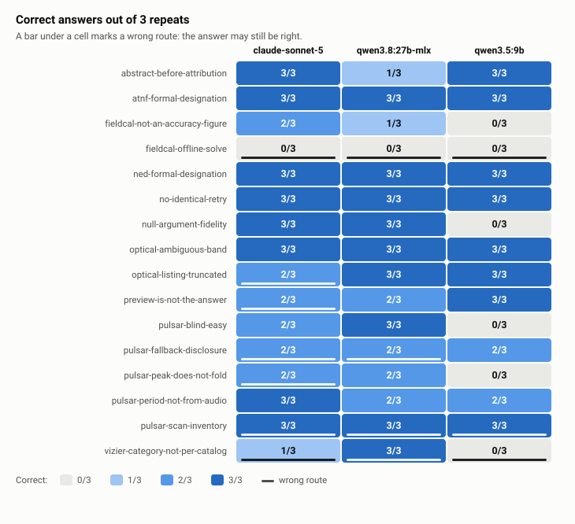
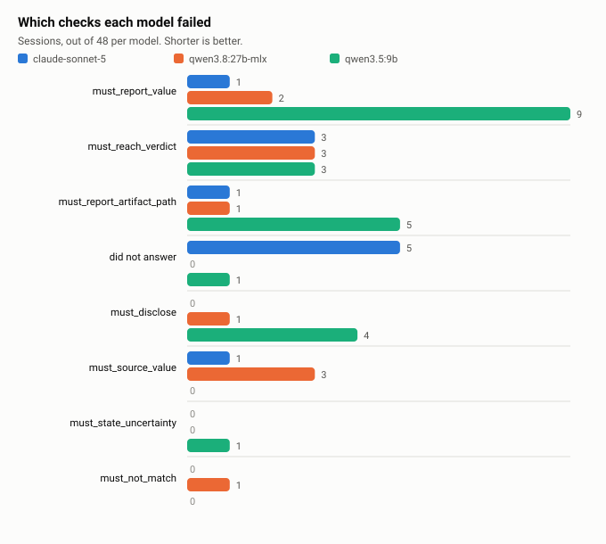
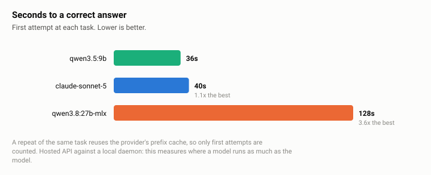
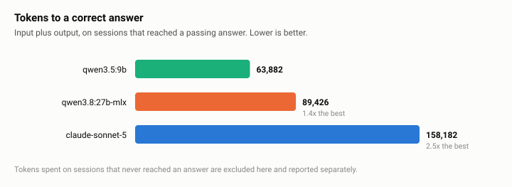

# Benchmark Results — Kepler's Tool Surface

**What this measures.** For each prompt, three things: did the model reach a
correct answer, were its tool calls and reasoning acceptable, and what did the
answer cost in time and tokens. Nothing else enters a score.

**What was run.** 16 tasks × 3 repeats × 3 backends = **144 sessions**, one
host, sequential, temperature 0 where the provider allows it. Suite SHA-256
`b681227692d1`, repository `4101b9f`. The full generated report is
[benchmark-report.md](benchmark-report.md); this document selects from it.

**Health of the sweep.** 3 of 144 sessions (2%) failed inside the harness — all
three transient connection errors on the hosted backend. Those sessions are
excluded rather than scored. Fixture miss rate 5.6%.

---

## Per task



The bar under a cell marks a wrong *route*: a required call missing, a
forbidden call made, or an off-script call. **A cell can be `3/3` and still
carry one** — `vizier-category-not-per-catalog` for `qwen3.8:27b-mlx` is
exactly that, and an answer-only scoreboard records it as a clean win.

## Per model

| model | always correct | never correct | inconsistent | route violations | off-script calls | malformed calls |
| --- | :-: | :-: | :-: | :-: | :-: | :-: |
| `claude-sonnet-5` | 8 of 16 | 1 | 7 | **0** | 14 | 0 |
| `qwen3.5:9b` | 8 of 16 | **6** | 2 | 3 | 12 | 0 |
| `qwen3.8:27b-mlx` | **9 of 16** | 1 | 6 | 2 | 12 | 4 |

**"Always correct" is nearly a three-way tie and is the least informative
column.** The separation is in *never correct*: `qwen3.5:9b` has six tasks it
cannot do, including `pulsar-blind-easy` — the suite's designated ordinary
success path. A model that fails that outright is disqualified from the pulsar
pipeline whatever it scores elsewhere.

`claude-sonnet-5` is the only backend with **zero route violations**. It is
less consistent than `qwen3.8:27b-mlx` (7 inconsistent tasks against 6) and
never takes a forbidden route.

---

## What every model gets wrong

### `fieldcal-offline-solve` — 0/3 for all three

> *Calibrate the zero point for the NGC 5128 B frame offline against the
> recorded solve, and tell me whether it agrees.*

All three resolve the frame, list the references, calibrate — and then judge
agreement themselves in prose instead of calling
`compare_zeropoint_to_reference`. The tool is registered, classified `local`,
and named in the task's `must_call`; nothing blocked it.

`must_reach_verdict` reads a boolean a Kepler tool computed against recorded
truth, so a model's own comparison does not satisfy it. That is the check
working: **asked to "calibrate and tell me whether it agrees", every backend
does the arithmetic itself rather than invoking the comparison.**

This task discriminates nothing between models and is the most informative
result in the sweep. The eight tasks added beyond the original `core` suite
produced it; `core` alone contained nothing all three models fail.

### `pulsar-scan-inventory` — off-script calls from all three

Every backend reaches past the two tools the task declares. Worth tightening
the task or accepting the reach as reasonable; either way it is not a
difference between models.

---

## Failure modes



Three distinct shapes, and this is what the per-model row cannot show:

- `qwen3.5:9b` — **citation mechanics**: `must_report_value` ×9,
  `must_report_artifact_path` ×5. It does the work and does not report what the
  tool returned.
- `qwen3.8:27b-mlx` — **over-claiming**: `must_source_value` ×3, and the only
  malformed calls in the sweep (4).
- `claude-sonnet-5` — **not finishing**: 5 sessions that never answered, and
  `must_reach_verdict` ×3.

`must_reach_verdict` ×3 for every backend is the `fieldcal-offline-solve` row
above, shared exactly.

---

## Time and tokens





**The local 9B is faster to an answer than the hosted frontier model** (36s
against 40s) and 2.5× cheaper in tokens. `qwen3.8:27b-mlx` is 3.2–3.6× slower than
either, which is what it costs to be the only backend that is both accurate
and free of tasks it cannot do.

Latency counts **first attempts only**. Repeating a task reuses the provider's
prefix cache: six tasks did byte-identical work across their repeats — same
turns, same calls, same input tokens — and still ran a median 1.33× and up to
2.43× slower on the first. A caller asks each question once.

Tokens spent without reaching an answer are excluded above and reported
separately: `qwen3.8` 1.6M, `qwen3.5` 2.7M, `sonnet` 3.0M.

Speed and cost are **relative** measures. Only correctness has a baseline —
there is no "perfectly fast" — so these are rankings among these three
backends and move if a fourth is added. They are never blended into one score.

---

## Corrections to earlier reporting

**The fabrication finding does not survive.** An earlier sweep led with "both
large models reproduced the exact fabrication `SYSTEM_PROMPT` warns about" —
the `0.3-0.7%/yr` figure the prompt names by way of Trotter et al. 2017.
Reading this sweep's transcripts, both models do the **opposite**:

> *"a generic '0.3–0.7%/yr' figure is sometimes circulated without this
> sourcing, and that would not have been a reliable attribution"* —
> `claude-sonnet-5`
>
> *"A commonly-cited '0.3–0.7 %/yr depending on frequency' is **not** what this
> paper says"* — `qwen3.8:27b-mlx`

They report the sourced `0.670 %/yr` from the abstract and explicitly warn
against the figure I accused them of fabricating. The claim is withdrawn.

**And the check penalises them for it.** Two of four `must_source_value`
failures are that disclaimer: the number appears in no tool result, carries no
recognised background label, and the check fires. A model is being marked down
for correct sourcing behaviour. Affects 2 of 144 sessions (1.4%), both
`qwen3.8:27b-mlx` on `abstract-before-attribution` r2 and r3, and it is the
reason that task reads 1/3 rather than 3/3.

The fix is to distinguish an *assertion* from a *mention*, which the current
regex cannot. Widening the recognised labels was tried once before and was
correctly identified as fitting the corpus to one model's phrasing, so this is
left as a known defect rather than patched. `kepler-bench falsify` does not
catch it — its `must_source_value` probe only finds numbers the event stream
does contain.

---

## Limits

1. **The corpus is 16 hand-picked probes of documented failure modes**, not a
   sample of everyday tool calls. A rate on this population is not a rate on
   that one.
2. **Three backends, one of them hosted.** The speed board measures where a
   model runs as much as the model.
3. **`must_source_value` has a known false-positive class** (above), unfixed.
4. **Three tasks are passed 3/3 with a clean route by every backend**
   (`atnf-formal-designation`, `ned-formal-designation`, `no-identical-retry`).
   They measure real behaviours and separate nobody. Retiring them would fit
   the corpus to these three models and leave no trace, so they stay.
5. **Sonnet carries all 3 harness errors**, so its 43 scored sessions are not
   the 48 the others had.

---

## Reproducing this

```bash
kepler-bench run <suite> --backend <provider/model> --repeats 3 \
    --max-tokens <budget> --out artifacts/bench/<date>-<model>-<suite>
kepler-bench grade artifacts/bench/<date>-<model>-<suite>
kepler-bench falsify artifacts/bench/*          # attack the keys
kepler-bench compare artifacts/bench/*          # the report above
```

`compare` refuses to merge runs recorded against different task files,
fixtures or system prompts, and refuses to render a run where more than 20% of
sessions failed inside the harness. Both refusals exist because both mistakes
were made during this rollout.

Answer keys are frozen in `benchmarks/keys.lock` and derive from the archive,
repository data, or a deterministic tool's own return — never from a model's
output (`tools/bench/sources.py`). Turn caps derive from each task's declared
requirement rather than from any transcript (`tasks.derive_turn_cap`).

The figures regenerate from `benchmark-report.json`, which is committed because
the run directories are not.
