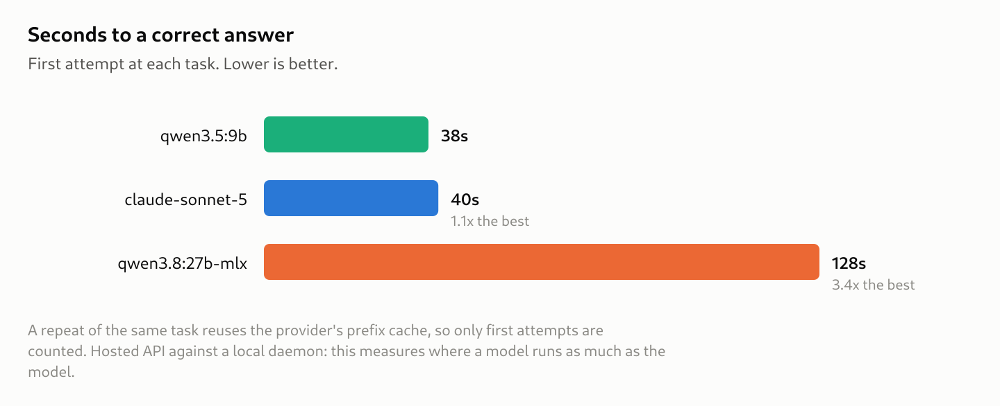

# Benchmark Results — Kepler's Tool Surface

**What this measures.** For each prompt, three things: did the model reach a
correct answer, were its tool calls and reasoning acceptable, and what did the
answer cost in time and tokens. Nothing else enters a score.

**What was run.** 16 tasks × 3 repeats × 3 backends = **144 sessions**, one
host, sequential, temperature 0 where the provider allows it. Suite SHA-256
`b681227692d1`, repository `4101b9f`. The full generated report is
[benchmark-report.md](benchmark-report.md); this document selects from it.

**Health of the sweep.** 3 of 144 sessions (2%) failed inside the harness — all
three transient connection errors on the hosted backend. Those sessions are
excluded rather than scored. Fixture miss rate 5.6%.

A further **20 sessions produced no answer text at all**, and 15 of those ended
`end_turn` — the model stopped of its own accord having written nothing. Those
are model results, not harness failures, and they are counted wrong. See
[Reading the answers](#reading-the-answers): three of them used to be counted
*correct*.

---

## Per task


The bar under a cell marks a wrong *route*: a forbidden call made, or a
declared call skipped or taken out of order. **A cell can be `3/3` and still
carry one** — `vizier-category-not-per-catalog` for `qwen3.8:27b-mlx` is
exactly that, and an answer-only scoreboard records it as a clean win. Every
check is defined in [Failure modes, defined](#failure-modes-defined) below.

## Per model

| model | always correct | never correct | inconsistent | forbidden routes | skipped/out-of-order calls | protocol faults |
| --- | :-: | :-: | :-: | :-: | :-: | :-: |
| `claude-sonnet-5` | 8 of 16 | 1 | 7 | **0** | 14 | 0 |
| `qwen3.5:9b` | 7 of 16 | **7** | 2 | 3 | 12 | 0 |
| `qwen3.8:27b-mlx` | **9 of 16** | 1 | 6 | 2 | 12 | 4 |

**"Always correct" separates the two large models by one task and is the least
informative column.** The separation is in *never correct*: `qwen3.5:9b` has
seven tasks it cannot do, including `pulsar-blind-easy` — the suite's
designated ordinary success path. A model that fails that outright is
disqualified from the pulsar pipeline whatever it scores elsewhere.

`claude-sonnet-5` is the only backend that never takes a **forbidden**
route — no `must_not_call` and no `arguments` failure in 43 scored sessions. It
is also less consistent than `qwen3.8:27b-mlx`, 7 inconsistent tasks against 6.

**The skipped-call column is two tasks, not twelve behaviours.** Every one of
those 38 marks comes from `fieldcal-offline-solve` and `pulsar-scan-inventory`
(plus a single sonnet session on `pulsar-fallback-disclosure`), and a skipped
call usually breaks the declared order too, so one skip scores twice. Read the
column as *these three models skip the same two calls*, not as a rate.

---

## What every model gets wrong

### `fieldcal-offline-solve` — 0/3 for all three

> *Calibrate the zero point for the NGC 5128 B frame offline against the
> recorded solve, and tell me whether it agrees.*

All three resolve the frame, list the references, calibrate — and then judge
agreement themselves in prose instead of calling
`compare_zeropoint_to_reference`. The tool is registered, classified `local`,
and named in the task's `must_call`; nothing blocked it.

`must_reach_verdict` reads a boolean a Kepler tool computed against recorded
truth, so a model's own comparison does not satisfy it. That is the check
working: **asked to "calibrate and tell me whether it agrees", every backend
does the arithmetic itself rather than invoking the comparison.**

This task discriminates nothing between models and is the most informative
result in the sweep. The eight tasks added beyond the original `core` suite
produced it; `core` alone contained nothing all three models fail.

### `pulsar-scan-inventory` — every backend skips `resolve_pulsar_scan`

All three call `list_pulsar_scans`, then go to `search_atnf` (sonnet also to
`search_simbad`) instead of resolving the scan the question is about. Both
halves are visible but only one is counted: the harness scores the *skipped*
declared call and the broken order, and **counts no extra call at all**.

The answers are still correct 3/3 for all three — the catalogue reaches the
same period the scan record carries. What the route says is that the models
treat "what's known about B0329+54" as a literature question when the bundled
scan already answers it. That is a soft finding by construction, and it is not
a difference between models.

---

## Failure modes, defined

Every mark in this document comes from one of the checks below. They are
grouped by axis, and within an axis by whether failing one makes the session
**wrong** (*hard*) or only makes it *noted* (*soft*). The split is deliberate:
a hard check forbids a documented mistake, a soft check prefers one good route
among several. Punishing an alternative correct route would make the suite age
as strategies change.

### Answer — the headline axis

A session is *correct* when it answered and failed no hard check.

| check | what it asserts | what a failure means | |
| --- | --- | --- | :-: |
| `incomplete` | the session produced a final answer at all | it ended in `error`, hit the turn cap, or exhausted the token budget. Not a wrong answer — **no** answer | hard |
| `must_reach_verdict` | a named Kepler tool returned a named boolean this session, with the required value | the model did not obtain the machine verdict. It reads the *tool's return*, so no phrasing can pass or fail it | hard |
| `must_report_value` | a number within a relative tolerance of a mechanically-resolved expectation appears in the answer | the model did the work and did not state the number, or stated a different one. The expectation comes from the archive, a repository data file, or a deterministic tool's own return this run — never a hand-typed literal | hard |
| `must_report_artifact_path` | the answer names an artifact this session actually wrote | the answer cites nothing, or cites a path the manifest does not record. Checked against the manifest, not a regex, so **an invented but plausible path fails**. Full path or recorded basename both count | hard |
| `must_not_match` | a specific forbidden statement does not appear | the model made the claim the task exists to catch | hard |
| `must_disclose` | a named warning or error code fired, so the answer acknowledges it | a bound was applied — a cap, a truncation, a fallback — and the answer presents the bounded result as complete. **Vacuous if the signal never fired**, so a model that avoided the bound is not penalised | hard |
| `must_label` | where a number matching a pattern appears, a required label appears within 80 characters of it | a quantity is stated bare where the bare number is meaningless — a spectral index without `alpha`, a scatter without its band. **Vacuous if the number never appears** | hard |
| `must_state_uncertainty` | a named field came back in a tool result, so the answer reports it — or does not misdescribe it | the tool returned an error, a null, or a confidence and the answer dropped it. **Vacuous if the field was never returned** | hard |
| `must_source_value` | every numeric literal in the answer appears in some tool result this session, within 0.5% | the model asserted a number no tool gave it. Designations (`NGC 6334`, `B0329+54`), years, and numbers carrying an explicit background label are excluded | hard |
| `conditional` | a guarded assertion: *if* tool X was (not) called, the answer must (not) match a pattern | the one failure mode the flat checks cannot express — attributing a figure to a named paper without fetching its abstract | hard |
| `must_match` | a required phrasing appears | another correct wording would also fail this, so it is **soft**. A task only one model's prose style can satisfy is measuring style | soft |

### Trajectory — diagnostic

A trajectory only matters through its effect on an answer, so nothing here
changes whether a session is correct. It is what explains the answer.

| check | what it asserts | what a failure means | |
| --- | --- | --- | :-: |
| `must_not_call` | a named tool was never called | the model took a route the task forbids. On this suite that is enumerating catalogues one at a time instead of searching a category, or reading a catalogued period before measuring one | hard |
| `arguments` | every call (or some call) to a named tool satisfies an argument predicate | the tool was reached with arguments that change its meaning — a cap left at its default where the task requires it lifted | hard |
| `must_call` | a declared tool was called at some point | a tool the reference route names was skipped. **Soft**: another route may reach the same answer | soft |
| `order` | the declared calls appear as an ordered subsequence of what was called | the stages ran out of order. **Soft**, same reason | soft |

**`must_call` and `order` are not a count of extra calls.** Nothing in the
harness counts a call the task did not ask for; a model may call anything on
the plane. The column previously printed as "off-script calls" counts *missing
and out-of-order* declared calls, and because a skipped call usually also
breaks the order, one skip scores two. That is why the column reads 12–14
across a sweep with only three such tasks in it.

### Protocol — diagnostic

Seven fault types, counted from the manifest as the adapter recorded them. A
fault is an observation, not an exception: the loop continues and the model
gets the error back.

| fault | what it means |
| --- | --- |
| `malformed_arguments_json` | the arguments were a string that did not parse as JSON |
| `schema_violation` | the arguments parsed but did not match the tool's schema — a missing required property, a wrong type, or a property the tool does not have |
| `unknown_tool` | a call naming a tool that is not on the plane |
| `stringified_null` | the string `"None"` where the schema wants JSON `null`. Never coerced: the two mean different things here |
| `call_id_mismatch` | a tool result whose id matches no outstanding call |
| `empty_tool_call` | the provider signalled a tool call and the content held none |
| `truncated_output` | the reply was cut at the token ceiling mid-call |

`null_argument_fidelity` sits on the same axis and is scored per
`(tool, property)` rather than counted: JSON `null` **passes** — the only way
to request an uncapped result; the property *absent* is **partial**, a
different semantic (capped at the default); a string or a plain integer
**fails**.

---

## Failure modes observed


Three distinct shapes, and this is what the per-model row cannot show:

- `qwen3.5:9b` — **silence**: `empty_answer` ×15. On 15 of its 48 sessions
  (31%) it worked the tools and then ended the turn with no text. Every other
  check it fails is in single figures.

  An earlier draft read this column as *citation mechanics* —
  `must_report_value` ×9, `must_report_artifact_path` ×5 — which was an
  artefact of grading an empty string against every check in the key. Those
  counts are now 3 and 1. The model is not failing to cite; it is failing to
  speak.
- `qwen3.8:27b-mlx` — **schema drift**: the only protocol faults in the sweep
  (4). Its `must_source_value` ×3 looks like over-claiming and mostly is not —
  two of the three are the known false positive documented below, firing on a
  *disclaimer* about a figure the model correctly refused to use.

  All four faults are the same `schema_violation`: `back_scale` passed to
  `compute_pulsar_periodogram`, on `pulsar-peak-does-not-fold` r2 and r3, twice
  each. `back_scale` is a real knob and `SYSTEM_PROMPT` names it in the retune
  instruction — it belongs to
  `load_pulsar_lightcurve`, stage 1, not to the periodogram at stage 2. The
  model applied the documented fix to the wrong stage.
- `claude-sonnet-5` — **not finishing**: 5 sessions that ran out of turns or
  hit an API error, and `must_reach_verdict` ×3. Its silence is the harness's,
  not its own: it has zero `empty_answer`.

`must_reach_verdict` ×3 for every backend is the `fieldcal-offline-solve` row
above, shared exactly.

---

## Time and tokens




**The local 9B is marginally faster to an answer than the hosted frontier
model** (38s against 40s) and 2.4× cheaper in tokens — but it reaches a correct
answer on 53% of sessions against sonnet's 86%, so the two boards are measuring
very different things and only the correctness one has a baseline.
`qwen3.8:27b-mlx` is 3.4× slower than either, which is what it costs to be the
backend with the fewest tasks it cannot do.

Latency counts **first attempts only**. Repeating a task reuses the provider's
prefix cache: six tasks did byte-identical work across their repeats — same
turns, same calls, same input tokens — and still ran a median 1.33× and up to
2.43× slower on the first. A caller asks each question once.

Tokens spent without reaching an answer are excluded above and reported
separately: `qwen3.8` 1.6M, `qwen3.5` 2.8M, `sonnet` 3.0M. Most of `qwen3.5`'s
went on sessions that called tools competently and then said nothing.

Speed and cost are **relative** measures. Only correctness has a baseline —
there is no "perfectly fast" — so these are rankings among these three
backends and move if a fourth is added. They are never blended into one score.

---

## Reading the answers

Every check above is a claim about a piece of prose, and until this pass
nothing in the harness put the prose in front of a reader. Two instruments
were added, and they found three things the scoreboard could not.

```bash
kepler-bench answers artifacts/bench/<run>   # the question beside the reply
kepler-bench grade   artifacts/bench/<run> --judge anthropic/claude-sonnet-5
```

`answers` is offline and free. The judge is the opt-in advisory column: it
receives **exactly two strings**, the task's answer key and the answer text —
no tool results, no trajectory, no fixture content — because one poisoned
fixture would otherwise corrupt the scoreboard permanently and invisibly. Its
verdict is reported in its own column and is **never blended into the score**.
It ran over all 144 sessions here for the first time.

### 1. An empty answer used to score correct

15 sessions ended `end_turn` having written nothing at all. On most that was
already wrong for other reasons, but `atnf-formal-designation` is graded
entirely on what the answer must *not* say — and **an empty string satisfies
every negative check vacuously**. `qwen3.5:9b` was recorded `3/3` on it, three
repeats out of three, having answered nothing three times. The advisory judge
passed those sessions too.

`empty_answer` is now a hard check (`tools/bench/graders/answer.py`), distinct
from `incomplete`: a model that runs out of turns did not answer, while a model
that ends its own turn in silence declined to. `qwen3.5:9b` drops from 8 always-correct
tasks to 7, from 6 never-correct to 7, and its headline correctness from 59% to
**53%**.

### 2. Non-numeric provenance is unchecked, and it is being fabricated

`must_source_value` requires every *number* in an answer to appear in a tool
result. Nothing checks anything else. The NED photometry fixture carries three
bibcodes and **no author names at all**:

```
1990ApJS...74..181Z   1994ApJS...91..111W   1997ApJ...482..245L
```

Across the sessions that cite them, the models expanded those three bibcodes
into **eight different author strings**, every one supplied from memory and
presented inside a table of tool results:

| bibcode | expanded as |
| --- | --- |
| `1990ApJS...74..181Z` | Zoonematkermani et al. 1990 ×6 · Zhu et al. 1990 ×3 |
| `1994ApJS...91..111W` | Wright et al. 1994 ×5 · White et al. 1994 ×2 |
| `1997ApJ...482..245L` | Liu et al. 1997 ×3 · Loughran et al. 1997 ×2 · Loup et al. 1997 · Muehleisen et al. 1997 |

At most three of the eight can be right. **The two models fail differently, and
the more alarming failure is the stable one.** `claude-sonnet-5` gives a
different name for `...245L` on every repeat — Loup, Loughran, Muehleisen — so
its guessing is visible the moment you run the task twice. `qwen3.8:27b-mlx`
returns Zhu / Wright / Liu identically on all three repeats, which makes an
unsourced guess look exactly like a retrieved fact. Stability is not accuracy,
and a benchmark that measures consistency across repeats will reward the second
model for it.

Every one of these sessions scored **correct** on the answer axis. The judge
passed all nine `ned-formal-designation` sessions; where it failed a
`no-identical-retry` one it was for an unrelated reason and never mentioned the
attributions. This is a gap in the corpus, not a bug in the graders: the fix is
a sourcing check that covers cited strings, not only numbers.

A smaller instance of the same class, from `pulsar-scan-inventory`: `qwen3.5:9b`
calls B0329+54 *"the 'Windsor' pulsar, one of the brightest and most easily
observed millisecond-range pulsars"* — on all three repeats, two lines below
correctly reporting its 0.7145197 s period, which is 714 ms and not a
millisecond pulsar. Correct 3/3, judge pass 3/3.

### 3. Where the judge and the checks disagree

21 of the 138 comparable sessions (15%). The disagreements are useful because
in each one, one of the two instruments is wrong — and reading them says which.

**The judge is right on `abstract-before-attribution`.** It passes the two
`qwen3.8:27b-mlx` sessions the deterministic `must_source_value` marks wrong,
which is the known false positive documented below, independently confirmed.

**The judge is wrong on `no-identical-retry`,** and it is wrong *structurally*.
It fails 5 of those 9 sessions — every `claude-sonnet-5` repeat and the first
of each qwen — for "reporting photometry without a successful resolver call".
That is a claim about the **trajectory**, which S1 isolation denies it by
design: it cannot see the call log, so it guessed, and the same judge on the
same task guessed both ways. No better prompt fixes this. A guarded check is
not something an instrument without the guard's evidence can evaluate.

**But it was pointing at a real defect.** The guard is
`when_not_called: [search_simbad]`, while the task's own trajectory rule says
the repair may come "from the model's own knowledge **or** via `search_simbad`".
A model that takes the sanctioned own-knowledge route has the guard opened
against it, and escapes only because the forbidden regex is narrow enough to
miss the natural phrasing. The key is internally inconsistent. Left recorded
rather than patched, for the same reason as the false positive below: changing
a key against three known transcripts is how a corpus gets fitted to them.

**Summary of the second instrument.** The judge agreed with the deterministic
checks on 85% of sessions, confirmed one known defect, pointed at one unknown
one, and was structurally incapable of evaluating a third — on which it returned
both verdicts across repeats of one task. It stays advisory
and off by default. *If the answer axis needs to discriminate more finely, the
answer is more per-task keys, not a better judge.*

---

## Corrections to earlier reporting

**The fabrication finding does not survive.** An earlier sweep led with "both
large models reproduced the exact fabrication `SYSTEM_PROMPT` warns about" —
the `0.3-0.7%/yr` figure the prompt names by way of Trotter et al. 2017.
Reading this sweep's transcripts, both models do the **opposite**:

> *"a generic '0.3–0.7%/yr' figure is sometimes circulated without this
> sourcing, and that would not have been a reliable attribution"* —
> `claude-sonnet-5`
>
> *"A commonly-cited '0.3–0.7 %/yr depending on frequency' is **not** what this
> paper says"* — `qwen3.8:27b-mlx`

They report the sourced `0.670 %/yr` from the abstract and explicitly warn
against the figure I accused them of fabricating. The claim is withdrawn.

**And the check penalises them for it.** Two of the four `must_source_value`
failures are that disclaimer: the number appears in no tool result, carries no
recognised background label, and the check fires. A model is being marked down
for correct sourcing behaviour. Affects 2 of 144 sessions (1.4%), both
`qwen3.8:27b-mlx` on `abstract-before-attribution` r2 and r3, and it is the
reason that task reads 1/3 rather than 3/3.

The fix is to distinguish an *assertion* from a *mention*, which the current
regex cannot. Widening the recognised labels was tried once before and was
correctly identified as fitting the corpus to one model's phrasing, so this is
left as a known defect rather than patched. `kepler-bench falsify` does not
catch it — its `must_source_value` probe only finds numbers the event stream
does contain. The advisory judge *does*: it passes both sessions, which is one
of the two useful things that instrument did here.

---

## Limits

1. **The corpus is 16 hand-picked probes of documented failure modes**, not a
   sample of everyday tool calls. A rate on this population is not a rate on
   that one.
2. **Three backends, one of them hosted.** The speed board measures where a
   model runs as much as the model.
3. **`must_source_value` has a known false-positive class** (above), unfixed.
4. **Nothing checks non-numeric provenance.** A fabricated author, catalogue
   name or object nickname passes every check in the suite. Two instances are
   documented above and neither is patched; this is the largest known hole.
5. **`no-identical-retry`'s answer guard is internally inconsistent** with its
   own trajectory rule (above), recorded rather than fixed.
6. **Three tasks are passed 3/3 with a clean route by every backend**
   (`ned-formal-designation`, `no-identical-retry`, `optical-ambiguous-band`).
   They measure real behaviours and separate nobody. Retiring them would fit
   the corpus to these three models and leave no trace, so they stay — and
   `ned-formal-designation` turns out to be where the fabricated attributions
   live, so "separates nobody" is not "measures nothing".
7. **Sonnet carries all 3 harness errors**, so its 43 scored sessions are not
   the 48 the others had.
8. **The judge ran on one model** (`claude-sonnet-5`), which also sits on the
   board it was judging. Its verdicts are advisory and enter no score, so this
   biases nothing that is reported as a result — but a judge that shares a
   family with a graded backend is not an independent reading of that backend.

---

## Reproducing this

```bash
kepler-bench run <suite> --backend <provider/model> --repeats 3 \
    --max-tokens <budget> --out artifacts/bench/<date>-<model>-<suite>
kepler-bench grade artifacts/bench/<date>-<model>-<suite>
kepler-bench falsify artifacts/bench/*          # attack the keys
kepler-bench answers artifacts/bench/* --wrong-only    # read the prose
kepler-bench compare artifacts/bench/*          # the report above
```

The advisory judge column is opt-in and costs one small model call per session:

```bash
kepler-bench grade artifacts/bench/<run> --judge anthropic/claude-sonnet-5
kepler-bench answers artifacts/bench/* --disagreed      # where it dissents
```

`compare` refuses to merge runs recorded against different task files,
fixtures or system prompts, and refuses to render a run where more than 20% of
sessions failed inside the harness. Both refusals exist because both mistakes
were made during this rollout.

Answer keys are frozen in `benchmarks/keys.lock` and derive from the archive,
repository data, or a deterministic tool's own return — never from a model's
output (`tools/bench/sources.py`). Turn caps derive from each task's declared
requirement rather than from any transcript (`tasks.derive_turn_cap`).

The figures regenerate from `benchmark-report.json`, which is committed because
the run directories are not:

```bash
uv run python docs/working/figures/make.py
```

The SVG is piped straight to `rsvg-convert` and never written out, so there is
no intermediate on disk to drift from the PNG beside it. Rendered at 2x for a
high-density display.
